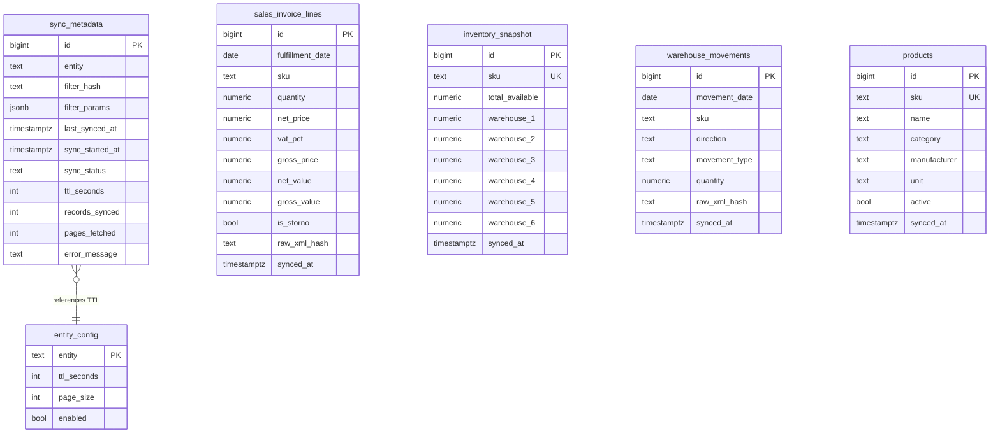

# Backend Architecture

## Data Flow


## How It Works

The frontend never calls the SOAP API directly. Instead, **Supabase PostgreSQL acts as a high-speed cache** between the UI and the legacy ERP.

### Request Lifecycle (stale-while-revalidate)

1. **`tharanis_client.py`** receives a data request (e.g. `get_sales("2024.01.01", "2024.12.31")`)
2. It queries **Supabase directly** via SQL (~50ms) and returns data immediately
3. In parallel, it checks `sync_metadata` — if the data is older than the TTL, it fires a background HTTP call to the `sync-entity` Edge Function
4. The Edge Function calls `claim_sync_lock()` — an atomic PL/pgSQL function that prevents duplicate syncs. If another sync is running or data is fresh, it returns early
5. If the lock is acquired, it paginates through the **Tharanis SOAP API** (200 records/page), parses XML, and upserts into the entity table
6. On completion, `release_sync_lock()` updates `sync_metadata` with timestamp and record count

The user sees cached data instantly. Fresh data appears on the next request after sync completes.

### Debouncing

50 users requesting the same data = **1 SOAP call**, not 50. The `claim_sync_lock()` function uses an atomic `UPDATE ... RETURNING` to grant exactly one caller the lock. All others get a "skipped" response. A 5-minute timeout auto-releases stuck locks.

### Entity TTLs

| Entity | Table | TTL | Sync Strategy |
|--------|-------|-----|---------------|
| `keszlet` | `inventory_snapshot` | 5 min | Full snapshot (upsert on SKU) |
| `kimeno_szamla` | `sales_invoice_lines` | 30 min | Incremental by date range |
| `raktari_mozgas` | `warehouse_movements` | 30 min | Incremental by date range |
| `cikk` | `products` | 24 h | Full snapshot (upsert on SKU) |

## File Structure

```
supabase/
  migrations/
    001_create_entity_tables.sql    -- sales, inventory, movements, products tables
    002_create_sync_metadata.sql    -- sync_metadata + entity_config + TTL seed data
    003_create_sync_functions.sql   -- claim_sync_lock() / release_sync_lock()
    004_enable_realtime.sql         -- Realtime on sync_metadata
  functions/
    _shared/
      soap-client.ts                -- SOAP envelope builder + HTTP POST
      xml-parser.ts                 -- XML → typed records (ported from Python)
      supabase-admin.ts             -- Supabase service-role client
      constants.ts                  -- API URL, table mappings, entity names
      types.ts                      -- TypeScript interfaces
    sync-entity/index.ts            -- Core: lock → SOAP paginate → upsert → unlock
    check-freshness/index.ts        -- Returns sync status (no SOAP calls)
    cron-refresh/index.ts           -- Scheduled: triggers sync-entity for each entity
    hydrate-all/index.ts            -- Admin: bulk historical load (limited by compute)
  config.toml                       -- Edge Function settings (JWT disabled)
mvp/
  app.py                            -- Streamlit frontend (unchanged)
  tharanis_client.py                -- Reads from Supabase, falls back to SOAP
  hydrate.py                        -- Local script for bulk historical loading
  .env                              -- SUPABASE_URL + SUPABASE_ANON_KEY + SOAP creds
```

## Database Schema


What "hydration" means here
Hydration = pre-filling Supabase with historical data from the ERP.

Normally, the middleware only syncs data on-demand — when a user opens the dashboard, it fetches whatever date range they're looking at. But that means the first user to request "show me 2019 sales" would wait 10+ seconds for the SOAP API to respond.

Hydration solves this by loading all available history upfront (June 2016 to present, month by month). After hydration, every query hits Supabase's pre-populated cache and returns in ~50ms, even for historical date ranges nobody has requested yet.

It's a one-time operation. Going forward, the cron-refresh Edge Function and stale-while-revalidate pattern keep the data fresh automatically.